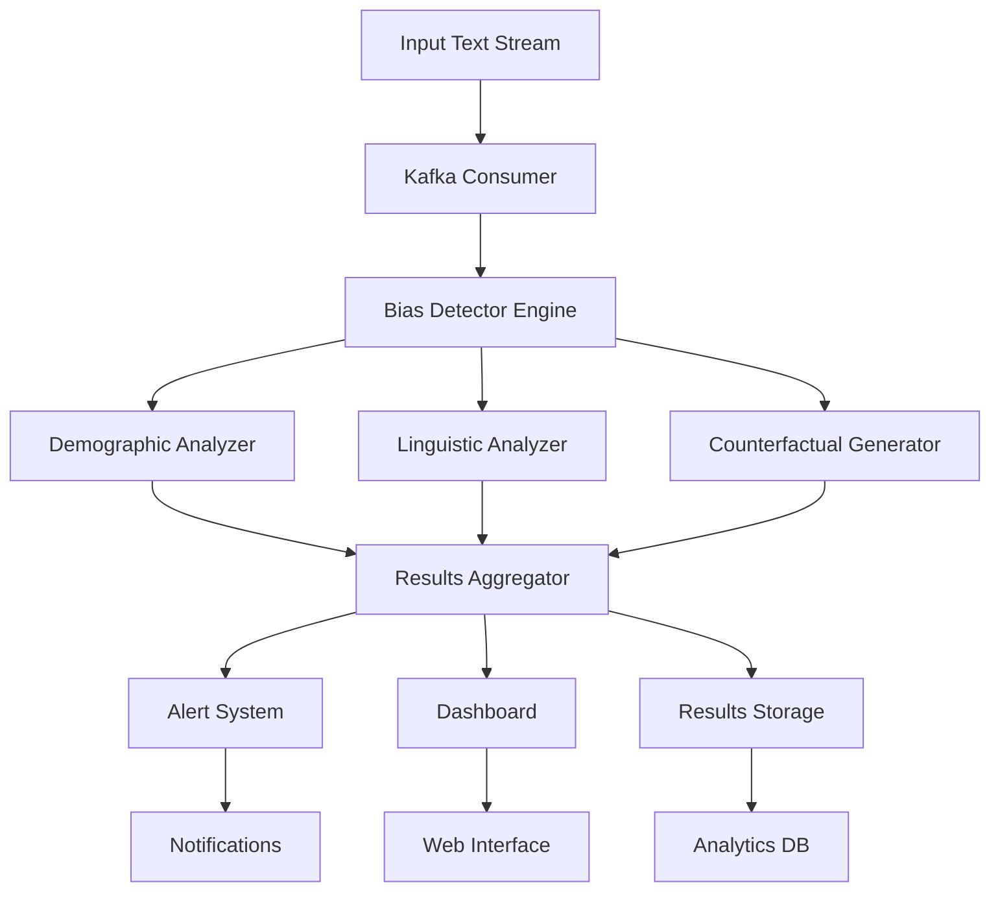

# 🎯 Project Argus: LLM Bias Detection System

> **Personal demonstration project showcasing advanced bias detection capabilities - designed to impress Meta AI**

[](https://opensource.org/licenses/MIT)
[](https://www.python.org/downloads/)
[](https://github.com/psf/black)
[](https://linkedin.com/in/michael-jaramillo-b61815278)

## 🚀 **Project Vision**

**Project Argus** is a cutting-edge bias detection system developed as a personal demonstration project, specifically designed to showcase advanced AI ethics capabilities that would be valuable for Meta's large language model ecosystem. This project demonstrates expertise in bias detection and responsible AI development:

### 🎯 **Potential Value for Meta**
- **Risk Mitigation**: Proactively identify and address bias before model deployment
- **Regulatory Compliance**: Meet evolving AI ethics standards and regulations
- **Brand Protection**: Maintain Meta's commitment to responsible AI development
- **Product Quality**: Enhance user experience through fair and inclusive AI systems
- **Research Leadership**: Advance the state-of-the-art in bias detection and mitigation

### 🔬 **Technical Innovation**
- **Llama-Optimized**: Specifically tuned for Meta's Llama model family
- **Real-time Detection**: Kafka-powered streaming bias monitoring
- **Multi-dimensional Analysis**: Comprehensive bias detection across demographics, linguistics, and culture
- **Counterfactual Testing**: Advanced bias probing through systematic input variation
- **Production-Ready**: Enterprise-grade monitoring, alerting, and dashboard systems

---

## 📋 **Table of Contents**

- [Features](#-features)
- [Architecture](#-architecture)
- [Quick Start](#-quick-start)
- [Installation](#-installation)
- [Usage](#-usage)
- [Configuration](#-configuration)
- [API Reference](#-api-reference)
- [Dashboard](#-dashboard)
- [Development](#-development)
- [Testing](#-testing)
- [Contributing](#-contributing)
- [License](#-license)
- [Contact](#-contact)

---

## 🌟 **Features**

### **Core Bias Detection**
- ✅ **Demographic Bias**: Gender, race, age, religion, socioeconomic status
- ✅ **Linguistic Bias**: Dialect discrimination, formality bias, language preference
- ✅ **Cultural Bias**: Cross-cultural fairness assessment
- ✅ **Intersectional Analysis**: Multiple protected attribute combinations
- ✅ **Statistical Significance**: Robust statistical testing and confidence intervals

### **Advanced Analytics**
- 🔍 **Counterfactual Generation**: Systematic bias probing through input variation
- 📊 **Fairness Metrics**: Demographic parity, equalized odds, individual fairness
- 🌐 **Multi-language Support**: Bias detection across 6+ languages
- 📈 **Trend Analysis**: Historical bias pattern identification
- 🎨 **Visualization**: Rich charts and interactive dashboards

### **Production Features**
- ⚡ **Real-time Monitoring**: Kafka-based streaming analysis
- 🚨 **Intelligent Alerting**: Configurable bias threshold alerts
- 📱 **Web Dashboard**: Streamlit-powered monitoring interface
- 🐳 **Cloud-Ready**: Docker containerization and Kubernetes deployment
- 🔒 **Enterprise Security**: PII anonymization and audit logging

### **Meta-Specific Optimizations**
- 🦙 **Llama Integration**: Optimized for Meta's Llama model family
- 🏗️ **Scalable Architecture**: Designed for Meta's infrastructure scale
- 🔬 **Research Integration**: Aligned with Meta's responsible AI research
- 📋 **Compliance Ready**: Built for regulatory and ethical standards

---

## 🏗️ **Architecture**



### **Component Overview**

| Component | Description | Technology Stack |
|-----------|-------------|------------------|
| **Bias Detector** | Core detection engine | PyTorch, Transformers, spaCy |
| **Analyzers** | Specialized bias analysis modules | NumPy, SciPy, scikit-learn |
| **Real-time Monitor** | Streaming data processing | Kafka, Redis, Celery |
| **Dashboard** | Web-based visualization | Streamlit, Plotly, Pandas |
| **API Layer** | REST and WebSocket APIs | FastAPI, Uvicorn |
| **Storage** | Results and configuration | PostgreSQL, MongoDB |

---

## 🚀 **Quick Start**

### **1. Installation**
```bash
# Clone the repository
git clone https://github.com/meta-labs/project-argus-bias-detection.git
cd project-argus-bias-detection

# Install dependencies
pip install -r requirements.txt

# Install the package
pip install -e .
```

### **2. Basic Usage**
```python
from argus import BiasDetector, ArgusConfig

# Initialize with default configuration
detector = BiasDetector()

# Analyze text for bias
texts = [
    "The engineer solved the complex problem efficiently.",
    "Women are naturally better at caring for children."
]

results = detector.detect_bias(texts)

print(f"Bias rate: {results.bias_rate:.2%}")
print(f"Detected {len(results.bias_instances)} bias instances")

# Generate recommendations
results.generate_recommendations()
for rec in results.recommendations:
    print(f"📋 {rec}")
```

### **3. Launch Dashboard**
```bash
# Start the monitoring dashboard
argus-dashboard

# Or use Python
python -m argus.monitors.dashboard
```
Navigate to `http://localhost:8501` to access the web interface.

### **4. Real-time Monitoring**
```python
from argus.monitors import RealTimeMonitor

# Start real-time bias monitoring
monitor = RealTimeMonitor()
monitor.start_monitoring()

# The monitor will process Kafka streams and send alerts
```

---

## 💾 **Installation**

### **Prerequisites**
- Python 3.8 or higher
- CUDA 11.8+ (for GPU acceleration)
- 8GB+ RAM (16GB+ recommended)
- Docker (optional, for containerized deployment)

### **Standard Installation**
```bash
# Create virtual environment
python -m venv argus-env
source argus-env/bin/activate  # On Windows: argus-env\Scripts\activate

# Install Project Argus
pip install project-argus-bias-detection

# Download required language models
python -m spacy download en_core_web_sm
python -m spacy download es_core_news_sm
```

### **Development Installation**
```bash
# Clone and install in development mode
git clone https://github.com/meta-labs/project-argus-bias-detection.git
cd project-argus-bias-detection
pip install -e ".[dev]"

# Install pre-commit hooks
pre-commit install
```

### **Docker Installation**
```bash
# Pull the official image
docker pull meta/project-argus:latest

# Or build from source
docker build -t project-argus .

# Run with GPU support
docker run --gpus all -p 8501:8501 project-argus
```

### **Kubernetes Deployment**
```bash
# Deploy to Kubernetes
kubectl apply -f deployment/kubernetes/

# Check deployment status
kubectl get pods -n argus-bias-detection
```

---

## 📚 **Usage**

### **Basic Bias Detection**

```python
from argus import BiasDetector, ArgusConfig

# Custom configuration
config = ArgusConfig()
config.model.model_name = "meta-llama/Llama-2-13b-chat-hf"
config.bias_detection.bias_threshold = 0.15

detector = BiasDetector(config)

# Single text analysis
result = detector.quick_bias_check("The doctor examined the patient carefully.")
if result['bias_detected']:
    print(f"⚠️ Bias detected: {result['bias_types']}")

# Batch analysis
texts = ["Text 1", "Text 2", "Text 3"]
results = detector.detect_bias(
    texts=texts,
    dataset_name="my_dataset",
    include_demographic=True,
    include_linguistic=True,
    include_counterfactual=True
)

# Export results
results.save_json("bias_analysis_results.json")
results.save_csv("bias_instances.csv")
```

### **Advanced Configuration**

```python
from argus.core.config import ArgusConfig

# Load configuration from file
config = ArgusConfig.from_yaml("configs/bias_detection.yaml")

# Customize bias detection
config.bias_detection.enable_gender_bias = True
config.bias_detection.enable_racial_bias = True
config.bias_detection.bias_threshold = 0.1

# Configure monitoring
config.monitoring.kafka_bootstrap_servers = "my-kafka:9092"
config.monitoring.alert_threshold = 0.2

# Set up multi-language detection
config.bias_detection.languages = ["en", "es", "fr", "de"]

detector = BiasDetector(config)
```

### **Real-time Monitoring Setup**

```python
from argus.monitors import RealTimeMonitor

# Initialize monitor
monitor = RealTimeMonitor(config)

# Add custom alert handler
def handle_bias_alert(alert_data):
    print(f"🚨 BIAS ALERT: {alert_data['alert_type']}")
    # Send to Slack, email, etc.

monitor.add_alert_callback(handle_bias_alert)

# Start monitoring
monitor.start_monitoring()
print("✅ Real-time bias monitoring started")

# Simulate input stream for testing
test_texts = ["Sample text 1", "Sample text 2"]
monitor.simulate_input_stream(test_texts, delay=1.0)
```

### **Dashboard Integration**

```python
from argus.monitors.dashboard import ArgusDashboard

# Launch interactive dashboard
dashboard = ArgusDashboard(config)
dashboard.run()  # Opens web interface at localhost:8501
```

### **Results Analysis**

```python
from argus.core.results import ResultsAggregator

# Compare multiple model results
aggregator = ResultsAggregator()
aggregator.add_results(results_model_1)
aggregator.add_results(results_model_2)

# Generate comparison
comparison = aggregator.compare_models()
print(comparison)

# Generate comprehensive report
report = aggregator.generate_comparative_report()
print(f"Best model: {report['best_model']['name']}")
print(f"Average bias rate: {report['average_bias_rate']:.2%}")
```

---

## ⚙️ **Configuration**

### **Configuration Files**

Project Argus uses YAML configuration files for flexible setup:

- `configs/bias_detection.yaml` - Main configuration
- `configs/meta_llm_config.yaml` - Meta Llama-specific settings

### **Key Configuration Sections**

#### **Model Configuration**
```yaml
model:
  model_name: "meta-llama/Llama-2-7b-chat-hf"
  model_type: "llama"
  device: "auto"
  max_length: 512
  temperature: 0.7
```

#### **Bias Detection Settings**
```yaml
bias_detection:
  enable_demographic_bias: true
  enable_linguistic_bias: true
  bias_threshold: 0.1
  languages: ["en", "es", "fr", "de"]
  counterfactual_samples: 1000
```

#### **Monitoring Configuration**
```yaml
monitoring:
  kafka_bootstrap_servers: "localhost:9092"
  batch_size: 100
  alert_threshold: 0.2
  dashboard_port: 8501
```

### **Environment Variables**

```bash
# Model settings
export ARGUS_MODEL_NAME="meta-llama/Llama-2-13b-chat-hf"
export ARGUS_DEVICE="cuda"

# Monitoring
export ARGUS_KAFKA_SERVERS="kafka1:9092,kafka2:9092"
export ARGUS_REDIS_HOST="redis.example.com"

# Meta-specific
export META_API_KEY="your-meta-api-key"
export ARGUS_LOG_LEVEL="INFO"
```

---

## 🔌 **API Reference**

### **Core Classes**

#### **BiasDetector**
Main bias detection engine.

```python
class BiasDetector:
    def __init__(self, config: ArgusConfig = None)
    def detect_bias(self, texts: List[str], **kwargs) -> BiasDetectionResults
    def quick_bias_check(self, text: str) -> Dict[str, Any]
    def batch_analyze(self, text_batches: List[List[str]]) -> List[BiasDetectionResults]
```

#### **BiasDetectionResults**
Container for bias detection results.

```python
class BiasDetectionResults:
    model_name: str
    bias_instances: List[BiasInstance]
    bias_rate: float
    overall_bias_score: float
    
    def get_bias_by_type(self, bias_type: BiasType) -> List[BiasInstance]
    def generate_recommendations(self) -> None
    def save_json(self, filepath: str) -> None
```

#### **ArgusConfig**
Configuration management.

```python
class ArgusConfig:
    @classmethod
    def from_yaml(cls, path: str) -> 'ArgusConfig'
    def save_yaml(self, path: str) -> None
    def validate(self) -> None
```

### **REST API**

Project Argus includes a FastAPI-based REST API:

```bash
# Start API server
uvicorn argus.api:app --host 0.0.0.0 --port 8000
```

#### **Endpoints**

```bash
# Health check
GET /health

# Analyze text for bias
POST /analyze
{
    "texts": ["Text to analyze"],
    "config": {
        "bias_threshold": 0.1,
        "include_counterfactual": true
    }
}

# Get analysis results
GET /results/{analysis_id}

# Real-time monitoring status
GET /monitoring/status

# Configuration management
GET /config
PUT /config
```

---

## 📊 **Dashboard**

### **Dashboard Features**

The Project Argus dashboard provides comprehensive bias monitoring:

#### **📈 Overview Page**
- Real-time metrics and KPIs
- System status indicators
- Recent alerts and warnings
- Bias detection trends

#### **📊 Analytics Page**
- Bias type distribution
- Severity level analysis
- Interactive filtering
- Detailed instance inspection

#### **🔍 Bias Detection Page**
- Interactive text analysis
- Multiple input methods (text, file upload)
- Real-time bias detection
- Downloadable results

#### **⚡ Real-time Monitoring Page**
- Live processing metrics
- Throughput and latency charts
- Alert history
- System controls

#### **⚙️ Configuration Page**
- Dynamic configuration editing
- Import/export settings
- System parameter tuning

### **Dashboard Screenshots**

*[Dashboard screenshots would be included here in a real deployment]*

---

## 🛠️ **Development**

### **Development Setup**

```bash
# Clone repository
git clone https://github.com/meta-labs/project-argus-bias-detection.git
cd project-argus-bias-detection

# Create development environment
python -m venv venv
source venv/bin/activate

# Install in development mode
pip install -e ".[dev]"

# Install pre-commit hooks
pre-commit install
```

### **Code Style**

Project Argus uses strict code formatting and linting:

```bash
# Format code
black argus/ tests/

# Lint code
flake8 argus/ tests/

# Type checking
mypy argus/

# Run all checks
pre-commit run --all-files
```

### **Project Structure**

```
project-argus-bias-detection/
├── argus/                      # Main package
│   ├── core/                   # Core components
│   │   ├── config.py          # Configuration management
│   │   ├── detector.py        # Main bias detector
│   │   └── results.py         # Results handling
│   ├── analyzers/             # Specialized analyzers
│   │   ├── demographic_analyzer.py
│   │   ├── linguistic_analyzer.py
│   │   └── counterfactual_generator.py
│   ├── monitors/              # Monitoring components
│   │   ├── real_time_monitor.py
│   │   └── dashboard.py
│   └── utils/                 # Utility functions
│       └── data_utils.py
├── configs/                   # Configuration files
├── tests/                     # Test suite
├── docs/                      # Documentation
├── deployment/                # Deployment configs
└── examples/                  # Usage examples
```

### **Adding New Features**

1. **Create Feature Branch**
   ```bash
   git checkout -b feature/new-bias-analyzer
   ```

2. **Implement Feature**
   - Add code in appropriate module
   - Include comprehensive tests
   - Update documentation

3. **Test Implementation**
   ```bash
   pytest tests/ -v
   pytest --cov=argus tests/
   ```

4. **Submit Pull Request**
   - Ensure all tests pass
   - Include feature documentation
   - Add example usage

---

## 🧪 **Testing**

### **Test Suite**

Project Argus includes comprehensive testing:

```bash
# Run all tests
pytest

# Run with coverage
pytest --cov=argus --cov-report=html

# Run specific test categories
pytest tests/test_core.py -v
pytest tests/test_analyzers.py -v

# Run performance tests
pytest tests/test_performance.py -v
```

### **Test Categories**

- **Unit Tests**: Individual component testing
- **Integration Tests**: Component interaction testing
- **Performance Tests**: Speed and memory benchmarks
- **End-to-End Tests**: Full pipeline testing

### **Continuous Integration**

```yaml
# .github/workflows/test.yml
name: Test Suite
on: [push, pull_request]
jobs:
  test:
    runs-on: ubuntu-latest
    steps:
      - uses: actions/checkout@v3
      - name: Set up Python
        uses: actions/setup-python@v4
        with:
          python-version: '3.10'
      - name: Install dependencies
        run: pip install -e ".[dev]"
      - name: Run tests
        run: pytest --cov=argus
```

---

## 🤝 **Contributing**

We welcome contributions to Project Argus! Please see our [Contributing Guide](CONTRIBUTING.md) for details.

### **Contribution Process**

1. **Fork the Repository**
2. **Create Feature Branch**
3. **Make Changes**
4. **Add Tests**
5. **Submit Pull Request**

### **Development Guidelines**

- Follow PEP 8 style guidelines
- Include comprehensive tests
- Update documentation
- Add type hints
- Write clear commit messages

### **Bug Reports**

Please use GitHub Issues to report bugs:

- Include system information
- Provide minimal reproduction case
- Attach relevant logs
- Specify expected vs actual behavior

---

## 📄 **License**

This project is licensed under the MIT License - see the [LICENSE](LICENSE) file for details.

```
MIT License

Copyright (c) 2025 Michael Jaramillo - Project Argus

Permission is hereby granted, free of charge, to any person obtaining a copy
of this software and associated documentation files (the "Software"), to deal
in the Software without restriction, including without limitation the rights
to use, copy, modify, merge, publish, distribute, sublicense, and/or sell
copies of the Software, and to permit persons to whom the Software is
furnished to do so, subject to the following conditions:

The above copyright notice and this permission notice shall be included in all
copies or substantial portions of the Software.

THE SOFTWARE IS PROVIDED "AS IS", WITHOUT WARRANTY OF ANY KIND, EXPRESS OR
IMPLIED, INCLUDING BUT NOT LIMITED TO THE WARRANTIES OF MERCHANTABILITY,
FITNESS FOR A PARTICULAR PURPOSE AND NONINFRINGEMENT. IN NO EVENT SHALL THE
AUTHORS OR COPYRIGHT HOLDERS BE LIABLE FOR ANY CLAIM, DAMAGES OR OTHER
LIABILITY, WHETHER IN AN ACTION OF CONTRACT, TORT OR OTHERWISE, ARISING FROM,
OUT OF OR IN CONNECTION WITH THE SOFTWARE OR THE USE OR OTHER DEALINGS IN THE
SOFTWARE.
```

---

## 📞 **Contact**

### **Project Maintainer**
**Michael Jaramillo**  
📧 Email: [jmichaeloficial@gmail.com](mailto:jmichaeloficial@gmail.com)  
💼 LinkedIn: [https://linkedin.com/in/michael-jaramillo-b61815278](https://linkedin.com/in/michael-jaramillo-b61815278)  
🐙 GitHub: [@jmichaeloficial](https://github.com/jmichaeloficial)

### **Project Information**
🎯 Purpose: Personal demonstration project to showcase AI ethics expertise  
🚀 Goal: Demonstrate capabilities valuable for Meta AI positions  
📁 Portfolio: Part of AI ethics and safety demonstration projects

### **Support Channels**
- 🎫 GitHub Issues: For technical questions and suggestions
- 💼 LinkedIn: For professional inquiries and opportunities
- 📧 Email: [jmichaeloficial@gmail.com](mailto:jmichaeloficial@gmail.com)

---

## 🙏 **Acknowledgments**

- **Meta AI Research Team** for foundational bias research
- **Hugging Face** for transformer model infrastructure
- **Apache Software Foundation** for Kafka streaming platform
- **Streamlit Team** for dashboard framework
- **Open Source Community** for various dependencies and tools

---

## 🔗 **Related Projects**

- [Meta Llama Models](https://github.com/facebookresearch/llama)
- [Fairlearn](https://github.com/fairlearn/fairlearn)
- [AI Fairness 360](https://github.com/Trusted-AI/AIF360)
- [Transformers](https://github.com/huggingface/transformers)
- [spaCy](https://github.com/explosion/spaCy)

---

<div align="center">

**🎯 Project Argus: Advancing Responsible AI at Meta**

*Ensuring fairness, inclusivity, and ethical AI deployment across Meta's language model ecosystem.*

---

**Made with ❤️ by Michael Jaramillo - Showcasing AI Ethics Expertise**

[](https://ai.meta.com)
[](https://ai.meta.com/responsible-ai/)

</div>
